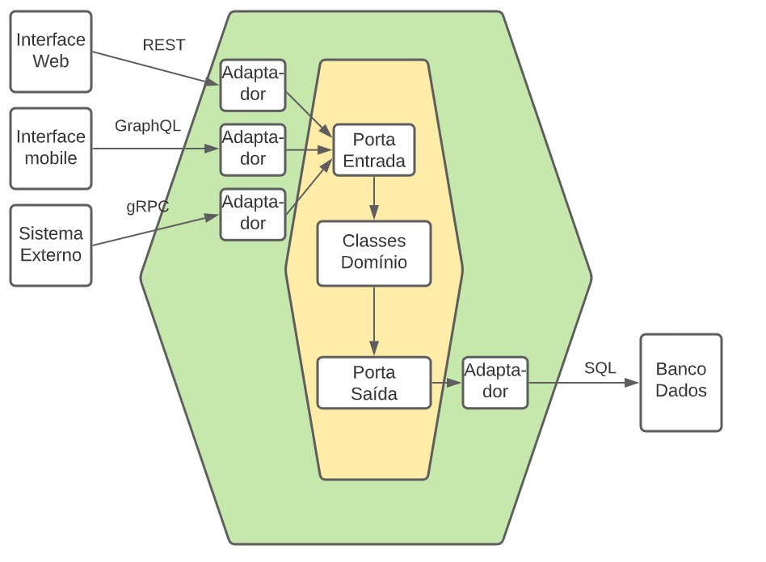

# hexagonal-arch

Aplicação criada para estudo da arquitetura hexagonal, separando o núcleo da aplicação, dos adaptadores. Os adaptadores de entrada, ou primários (Driving), foram implementados como uma API e um aplicativo console. Os adaptadores de saída, ou secundários (Driven), incluem conexões com banco de dados, integrações HTTP e, especificamente nesta aplicação, integração com AWS S3, integração com a API ViaCep e conexão com o banco de dados.

No Core da aplicação, temos todo o núcleo, incluindo entidades, objetos de valor, exceções personalizadas e o serviço responsável pela lógica de negócios. Uma das partes mais importantes para a arquitetura hexagonal são as Ports, que são interfaces (contratos) que servem de ponte entre os adaptadores(Driving e Driven) e o núcleo.

